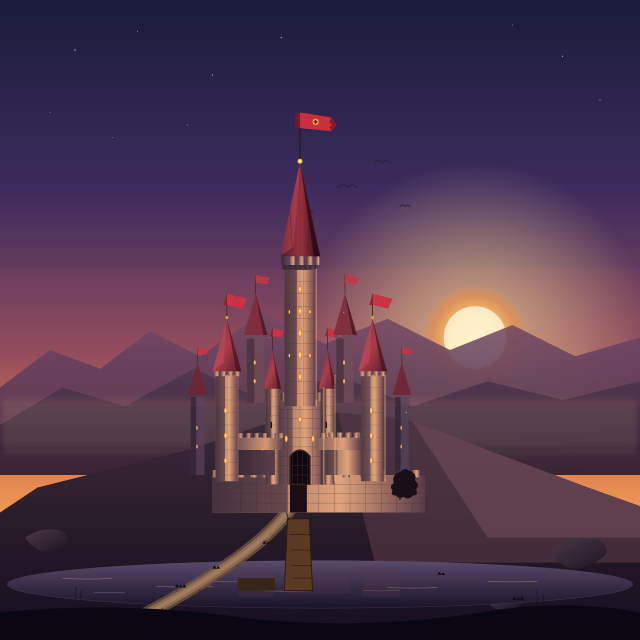
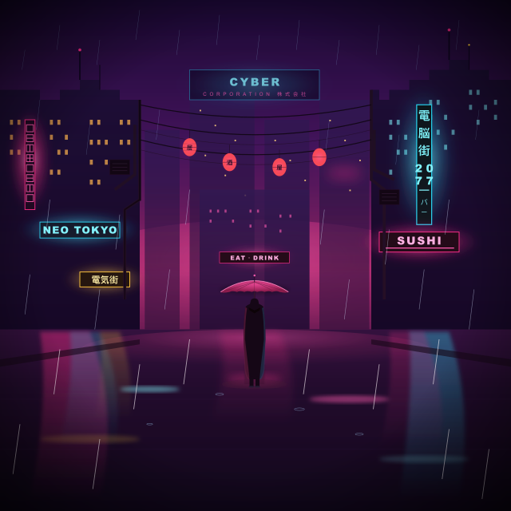
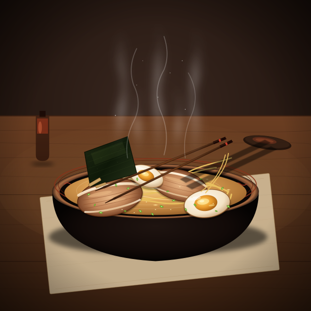
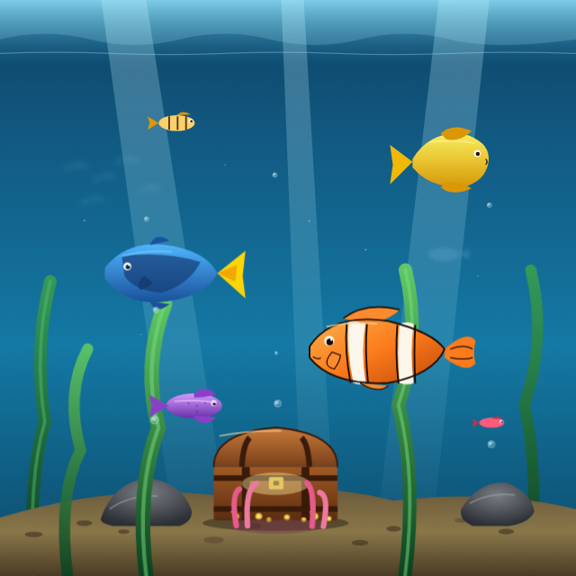

# generate_svg

An LLM-driven SVG generator that ports the prompt-engineering philosophy of
[MineBench](https://github.com/) (the voxel-build arena) to 2D vector art.

MineBench never asks the model for raw voxel coordinates blind — it wraps the
request in a heavy system prompt (judging criteria, failure modes, build-order
discipline, "think before you draw") and gives the model a constrained way to
emit geometry. `generate_svg` applies the same idea to SVG: instead of a thin
"draw an SVG of X" one-liner, it hands the model a rigorous art-director brief
and a strict output contract, then validates and repairs the result.

It is a single Go binary that shells out to the `claude` CLI (`claude -p`), so
there is no API key handling and no SDK — it reuses whatever authentication
your `claude` command already has.

## Showcase

All generated by `generate_svg` from a single text prompt, first attempt unless
noted. Click any image to open its source SVG. (The previews are PNGs because
GitHub does not animate embedded SVGs — open the SVG to see motion.)

| | | |
|:--:|:--:|:--:|
| [](examples/boat.svg) | [](examples/castle.svg) | [](examples/cyberpunk-alley.svg) |
| *"a cute boat floating on a riverside"* | *"a medieval castle on a hill at dusk"* | *"a neon cyberpunk alley in the rain"* |
| [](examples/ramen.svg) | [](examples/lighthouse.svg) | [](examples/aquarium.svg) |
| *"a steaming bowl of tonkotsu ramen"* | *"a lighthouse with a sweeping beam"* ▶ `--animate` | *"a home aquarium with tropical fish"* ▶ `--animate` |

> Sweet spot: scenes, architecture, objects, food, atmosphere. Hard for any
> SVG generator: photorealistic human faces and flowing creature anatomy — see
> `--refine-rounds` for the perception loop that helps with structural flaws.

## Usage

```sh
generate_svg -p "Generate a cute boat floating on a riverside" -o sample.svg
```

Flags:

| flag | default | meaning |
|------|---------|---------|
| `-p` | (required) | the build request / what to draw |
| `-o` | (required) | output `.svg` file path |
| `-m` | claude default | model alias passed to `claude --model` (e.g. `opus`, `sonnet`) |
| `--retries` | `3` | max repair attempts when output is invalid |
| `--min-elements` | `8` | reject lazy builds with fewer drawable elements |
| `--canvas` | `1024` | square viewBox size hinted to the model |
| `--png` | `false` | also render a PNG preview next to the SVG (needs `rsvg-convert` or macOS `qlmanage`) |
| `--png-size` | `0` | PNG preview pixel size; `0` = use `--canvas` |
| `--refine-rounds` | `0` | vision-critique redraw rounds: render, critique the image, redraw, keep best (needs a renderer) |
| `--animate` | `false` | produce a self-contained animated SVG (SMIL): movable parts get pivots + looping motion |
| `-v` | `false` | verbose: print the prompt and each attempt to stderr |

With `--png`, `boat.svg` also produces `boat.png` (renderer chosen automatically:
`rsvg-convert` if present, otherwise macOS `qlmanage`). A preview failure is only
a warning — the SVG is still written.

### Refine loop (`--refine-rounds`)

The plain generator is *blind*: the model writes SVG as text and never sees the
rendered result, so it cannot tell that a face's eyes came out crooked or a
creature's silhouette is mushy. `--refine-rounds N` closes that perception gap:

1. render the current SVG to PNG,
2. a vision model opens the PNG (via its `Read` tool) and scores it `0-100` with
   a prioritized list of concrete flaws,
3. the model redraws guided by that critique,
4. repeat for `N` rounds, then **return the highest-scoring version**.

Important and honest caveats:

- It is **best-of-iterations, not monotonic**. A redraw can come out *worse* than
  the previous one; the loop keeps the best-scored version, so a bad round never
  regresses your result — but a single round is not guaranteed to improve it.
- Gains are largest on **fixable structural problems** (proportion, missing
  detail, composition, silhouette). On subjects that need sub-pixel realism
  (photographic human faces) perception helps but SVG generation precision is
  still the ceiling.
- Cost scales: each round is roughly one render + one vision critique + one
  redraw (≈3 model calls). Complex subjects can be slow — raise `--timeout`.

### Animation (`--animate`)

SVG has no skeleton, and the plain output is a static illustration whose `<g>`
groups exist only for draw order. `--animate` asks the model to instead build an
*animation-aware* SVG: wrap each movable part (wings, limbs, tail, steam, glow)
in its own named group and drive it with self-contained SMIL — `<animateTransform>`
and `<animate>`, no JavaScript or CSS.

The prompt bakes in the two pivot rules that make or break SVG motion: encode the
rotation center inline in the `rotate` value (so a wing turns about its shoulder,
not the canvas origin), and keep movable groups free of a static `transform` so
the animation does not clobber it. Generation is rejected and repaired if it
contains no animation elements.

Caveats:

- The output is a single animated `.svg` — **open it in a browser to see it move**.
  `--png` and the refine renderer only rasterize one frame, so they cannot preview
  motion.
- Motion quality is the model's call: pivots can still land slightly off. The
  vision-critique loop cannot judge motion from a single frame, so `--refine-rounds`
  improves the static composition, not the animation timing.

## Requirements

- Go 1.22+ to build
- the `claude` CLI on `PATH`, already authenticated
- optional: `rsvg-convert` or macOS `qlmanage` for `--png` previews

## Install

```sh
go install github.com/hoveychen/svg_generator/cmd/generate_svg@latest
```

## How it works

1. **Brief** — builds a MineBench-style system prompt: an art-director rubric
   (recognizability, composition, depth via layering, proportion, color
   harmony, abundant intentional detail), explicit failure modes to avoid
   (generic AI clipart, flat shapes, no scene, uniform detail), a build order
   (background → subject silhouette → secondary forms → details/atmosphere),
   and a strict "output ONLY raw SVG" contract.
2. **Generate** — invokes `claude -p` with that system prompt and the request.
3. **Extract & validate** — pulls the `<svg>…</svg>` out of the response,
   checks it parses as XML, has a `viewBox`, and clears the element-count floor.
4. **Repair** — on failure, re-prompts with the validation error and the
   previous output (mirroring MineBench's repair loop), up to `--retries` times.
5. **Refine** *(optional, `--refine-rounds`)* — renders the SVG, has a vision
   model critique the image, redraws from the critique, and keeps the
   best-scored version. See the refine-loop section above.

## License

MIT
